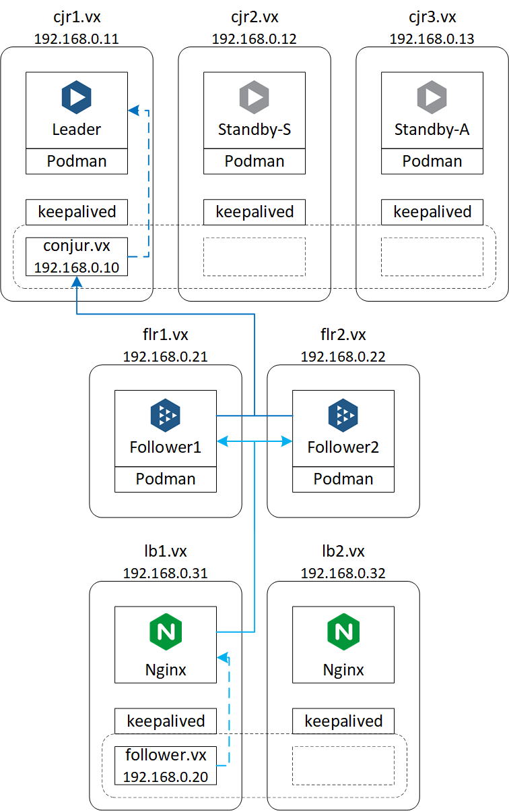
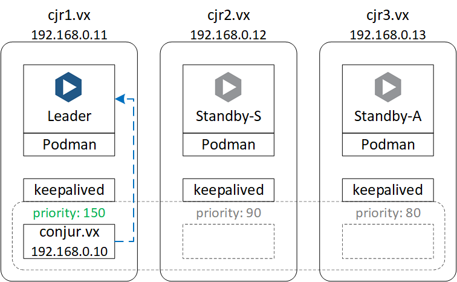
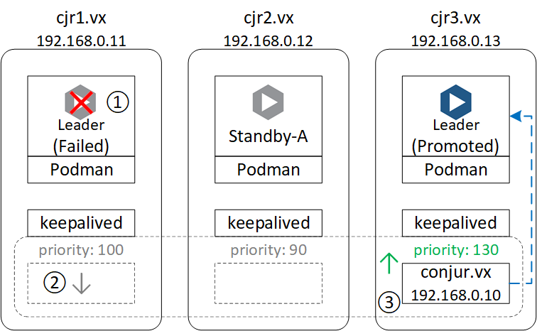

# Conjur Enterprise cluster and followers + Podman + RHEL 9 + Keepalived + Nginx

## Introduction
A Conjur Enterprise deployments consists of 2 planes:
1. Control plane called the Conjur cluster
  - The Conjur Cluster comprises 1 leader node, 1 synchronous standby node, and 1 or more asynchronous standby nodes
  - Only the leader is active, all standby nodes are just data replicas
2. Client access plane called the Conjur follower
  - The Conjur follower comprises identical follower nodes that are all active
  - The followers are meant to be deployed close to the client applications to handle read requests, including authentication, permission checks, and secret fetches


Ref: <https://docs.cyberark.com/Product-Doc/OnlineHelp/AAM-DAP/Latest/en/Content/References/cjr-architecture.htm>

A load balancer (LB) is recommended to be placed in front of each plane to facilitate high availabiliy and load balancing

## Motivation for this guide
- The Conjur cluster is an active-passive cluster, using LB to provide high availability and route traffic just to 1 node doesn't seem to be the most efficient solution
  - The LB tier is a dependency on external factors - this can create operational overhead and additional complexities during deployment and troubleshooting
  - The health check on the passive nodes will result in large volume of real-server-down alerts
  - Depending on the LB proposed, Conjur leader failover detection may not work as expected, or there may be delays from the LB in traffic routing after Conjur leader failover
- Active-passive clustering solutions (routers, firewalls, databases, even LBs) commonly use VRRP to perform virtual service failover
  - Keepalived implements VRRP on linux servers
  - It is lightweight and simple to configure
  - It is reliable and fast in detecting a failover and moving the virtual service to the promoted leader node
- LB is still required to balance traffic across the Conjur follower nodes
  - Nginx + Keepalived is a common LB solution based on the paid [Nginx Plus version](https://docs.nginx.com/nginx/admin-guide/high-availability/ha-keepalived/)

## Solution Overview


This guide walks through the setup for Conjur Enterprise cluster and followers on Podman on RHEL 9 using:
- Keepalived for cluster floating IP address
- Nginx + Keepalived load balancers for followers

## Lab Environment
### Software Versions

|Software|Version|
|---|---|
|RHEL|9.0|
|Podman|4.0.2|
|Conjur Enterprise|12.6|
|Keepalived|2.2.4|
|Nginx|1.20.1|

### Servers/Networking

|Function|Hostname|IP Address|
|---|---|---|
|Conjur cluster service|conjur.vx|192.168.0.10|
|Conjur leader node|cjr1.vx|192.168.0.11|
|Conjur standby node 1|cjr2.vx|192.168.0.12|
|Conjur standby node 2|cjr3.vx|192.168.0.13|
|Conjur follower service|follower.vx|192.168.0.20|
|Conjur follower nodes|flr{1..2}.vx|192.168.0.{21..22}|
|Load balancers|lb{1..2}.vx|192.168.0.{31..32}|

# 1. Setup host prerequisites and Conjur appliance container on all Conjur nodes
📌 Perform on **all Conjur nodes**
# 1.1 Setup host prerequisites
- Install Podman
- Upload `conjur-appliance_12.6.0.tar.gz` to the container host: contact your CyberArk representative to acquire the Conjur container image
- Prepare data directories: these directories will be mounted to the Conjur container as volumes
- Setup [Conjur CLI](https://github.com/cyberark/cyberark-conjur-cli): the client tool to interface with Conjur
```console
yum -y install podman
podman load -i conjur-appliance_12.6.0.tar.gz
mkdir -p /opt/conjur/{security,config,backups,seeds,logs}
curl -L -o conjur-cli-rhel-8.tar.gz https://github.com/cyberark/conjur-api-python3/releases/download/v7.1.0/conjur-cli-rhel-8.tar.gz
tar xvf conjur-cli-rhel-8.tar.gz
mv conjur /usr/local/bin/
```
- Clean-up
```console
rm -f conjur-appliance_12.6.0.tar.gz conjur-cli-rhel-8.tar.gz
```

## 1.1.1 Note on SELinux and Container Volumes
- SELinux may prevent the container access to the data directories without the appropriate SELinux labels
- Ref: [podman-run - Labeling Volume Mounts](https://docs.podman.io/en/latest/markdown/podman-run.1.html)
- There are 2 ways to enable container access to the data directories:
  1. Use `semanage fcontext` and `restorecon` to relabel the data directories
    ```console
    yum install -y policycoreutils-python-utils
    semanage fcontext -a -t svirt_sandbox_file_t "/opt/conjur(/.*)?"
    restorecon -R -v /opt/conjur
    ```
  2. Add `:z` or `:Z` to the volume mounts when running the container so that Podman will automatically label the data directories
    - `:z` - indicates that content is shared among multiple container
    - `:Z` - indicates that content is is private and unshared

## 1.2. Run Conjur appliance container
### 1.2.1 Method 1: Running Conjur master on the default bridge network
- Podman run command:
```console
podman run --name conjur -d \
--restart=unless-stopped \
-p "443:443" -p "444:444" -p "5432:5432" -p "1999:1999" \
--log-driver journald \
-v /opt/conjur/config:/etc/conjur/config:Z \
-v /opt/conjur/security:/opt/cyberark/dap/security:Z \
-v /opt/conjur/backups:/opt/conjur/backup:Z \
-v /opt/conjur/seeds:/opt/cyberark/dap/seeds:Z \
-v /opt/conjur/logs:/var/log/conjur:Z \
registry.tld/conjur-appliance:12.6.0
```

### 1.2.2 Method 2: Running Conjur master on the Podman host network
- Podman run command:
```console
podman run --name conjur -d \
--restart=unless-stopped \
--network host \
--log-driver journald \
-v /opt/conjur/config:/etc/conjur/config:Z \
-v /opt/conjur/security:/opt/cyberark/dap/security:Z \
-v /opt/conjur/backups:/opt/conjur/backup:Z \
-v /opt/conjur/seeds:/opt/cyberark/dap/seeds:Z \
-v /opt/conjur/logs:/var/log/conjur:Z \
registry.tld/conjur-appliance:12.6.0
```
- Add firewall rules on the Podman host
```console
firewall-cmd --add-service https --permanent
firewall-cmd --add-service postgresql --permanent
firewall-cmd --add-port 444/tcp --permanent
firewall-cmd --add-port 1999/tcp --permanent
firewall-cmd --reload
```

## 1.3 Configure container to start on boot
- Run the Conjur container as systemd service and configure it to setup with container host
- Ref: <https://access.redhat.com/documentation/en-us/red_hat_enterprise_linux_atomic_host/7/html/managing_containers/running_containers_as_systemd_services_with_podman>
```console
podman generate systemd conjur --name --container-prefix="" --separator="" > /etc/systemd/system/conjur.service
systemctl enable conjur
```

# 2. Setup Conjur leader node
📌 Perform on **Conjur leader node**: the leader node is `cjr1.vx` / `192.168.0.11` in this lab environment
## 2.1 Configure Conjure leader
- Edit the admin account password in `-p` option and the Conjur account (`cyberark`) according to your environment
```console
podman exec conjur evoke configure master --accept-eula -h conjur.vx --master-altnames "conjur.vx" -p CyberArk123! cyberark
```

## 2.2 Setup Conjur certificates
### Lab environment certificate chain
- The `conjur-certs.tgz` includes my personal certificate chain for CA, leader and follower, you should generate your own certificates
- Refer to <https://joetanx.github.io/self-signed-ca/> for a guide to generate your own certificates
- ☝️ **Note**: The Common Name of Conjur certificates should be the FQDN of the access endpoint, otherwise errors will occur

|Certificate|Purpose|Common Name|Subject Alternative Names|
|---|---|---|---|
|central.pem|Certificate Authority|Central Authority||
|conjur.pem / conjur.key|Conjur cluster certificate|conjur.vx|cjr1.vx, cjr2.vx, cjr3.vx|
|follower.pem / follower.key|Conjur follower certificate|follower.vx|flr1.vx, flr2.vx|

- ☝️ **Note**: In event of `error: cert already in hash table`, ensure that the Conjur serverfollower certificates do not contain the CA certificate
```console
curl -L -o conjur-certs.tgz https://github.com/joetanx/conjur-cluster/raw/main/conjur-certs.tgz
podman cp conjur-certs.tgz conjur:/opt/cyberark/dap/certificates/
podman exec conjur tar xvf /opt/cyberark/dap/certificates/conjur-certs.tgz -C /opt/cyberark/dap/certificates/
podman exec conjur evoke ca import -fr /opt/cyberark/dap/certificates/central.pem
podman exec conjur evoke ca import -k /opt/cyberark/dap/certificates/conjur.key -s /opt/cyberark/dap/certificates/conjur.pem
podman exec conjur evoke ca import -k /opt/cyberark/dap/certificates/follower.key /opt/cyberark/dap/certificates/follower.pem
podman exec conjur cp /opt/conjur/etc/ssl/follower.vx.pem /opt/conjur/etc/ssl/flr1.vx.pem
podman exec conjur cp /opt/conjur/etc/ssl/follower.vx.key /opt/conjur/etc/ssl/flr1.vx.key
podman exec conjur cp /opt/conjur/etc/ssl/follower.vx.pem /opt/conjur/etc/ssl/flr2.vx.pem
podman exec conjur cp /opt/conjur/etc/ssl/follower.vx.key /opt/conjur/etc/ssl/flr2.vx.key
```
- Clean-up
```console
podman exec conjur rm -rf /opt/cyberark/dap/certificates
rm -f conjur-certs.tgz
```

## 2.3 Verify status of Conjur leader
- Verify the Conjur health and all services are running before continuing to setup standby nodes
```console
curl https://cjr1.vx/info
curl https://cjr1.vx/health
podman exec conjur sv status conjur nginx pg seed
```

# 3. Setup Conjur standby nodes
## 3.1 Generate seed files on Conjur leader node
📌 Perform on **Conjur leader node**
- These commands generate the seed files and copy them to the standby nodes using scp
```console
podman exec conjur evoke seed standby cjr2.vx cjr1.vx > standby-cjr2.vx-seed.tar
podman exec conjur evoke seed standby cjr3.vx cjr1.vx > standby-cjr3.vx-seed.tar
scp -o StrictHostKeyChecking=no standby-cjr2.vx-seed.tar root@cjr2.vx:
scp -o StrictHostKeyChecking=no standby-cjr3.vx-seed.tar root@cjr3.vx:
```
- Clean-up
```console
rm -f standby-cjr* .ssh/known_hosts
```
- Verify services of the Conjur container: `conjur` should be down, other services should be running
```console
podman exec conjur sv status conjur nginx pg seed
```

## 3.2 Configure Conjur standby node 1
📌 Perform on **Conjur standby node 1**: this is `cjr2.vx` / `192.168.0.12` in this lab environment
- The seed generation step previously should have copied the seed file to the `/root` directory
- Copy the seed file from host to container, unpack the seed file, Configure node as Conjur standby
```console
podman cp standby-cjr2.vx-seed.tar conjur:/tmp
podman exec conjur evoke unpack seed /tmp/standby-cjr2.vx-seed.tar
podman exec conjur evoke configure standby
```
- Clean-up
```console
podman exec conjur rm -rf /tmp/standby-cjr2.vx-seed.tar
rm -f standby-cjr2.vx-seed.tar
```
- Verify services of the Conjur container: `conjur` should be down, other services should be running
```console
podman exec conjur sv status conjur nginx pg seed
```

## 3.3 Configure Conjur standby 2
📌 Perform on **Conjur standby node 2**: this is `cjr3.vx` / `192.168.0.13` in this lab environment
- The seed generation step previously should have copied the seed file to the `/root` directory
- Copy the seed file from host to container, unpack the seed file, Configure node as Conjur standby
```console
podman cp standby-cjr3.vx-seed.tar conjur:/tmp
podman exec conjur evoke unpack seed /tmp/standby-cjr3.vx-seed.tar
podman exec conjur evoke configure standby
```
- Clean-up
```console
podman exec conjur rm -rf /tmp/standby-cjr3.vx-seed.tar
rm -f standby-cjr3.vx-seed.tar
```
- Verify services of the Conjur container: `conjur` should be down, other services should be running
```console
podman exec conjur sv status conjur nginx pg seed
```

## 3.4 Verify that both standby nodes are replicating from the leader
- Check health from leader
```console
curl https://cjr1.vx/health
```
- Sample output from `replication_status` section
```console
    "replication_status": {
      "pg_stat_replication": [
        {
          "usename": "conjur.vx",
          "application_name": "standby_cjr2_vx_cjr2_vx",
          "client_addr": "192.168.0.12",
          "backend_start": "2022-06-12 06:32:49 +0000",
          "state": "streaming",
          "sent_lsn": "0/907AD78",
          "replay_lsn": "0/907AD78",
          "sync_priority": 1,
          "sync_state": "async",
          "sent_lsn_bytes": 151498104,
          "replay_lsn_bytes": 151498104,
          "replication_lag_bytes": 0
        },
        {
          "usename": "conjur.vx",
          "application_name": "standby_cjr3_vx_cjr3_vx",
          "client_addr": "192.168.0.13",
          "backend_start": "2022-06-12 06:33:18 +0000",
          "state": "streaming",
          "sent_lsn": "0/907AD78",
          "replay_lsn": "0/907AD78",
          "sync_priority": 2,
          "sync_state": "async",
          "sent_lsn_bytes": 151498104,
          "replay_lsn_bytes": 151498104,
          "replication_lag_bytes": 0
        },
```

## 3.5 Enable synchronous replication
📌 Perform on **Conjur leader node**
```console
podman exec conjur evoke replication sync start
```
- Check health from leader again, you should see the `sync_state` change from `async` to `sync` for one standby node and `potential` for the other standby node
```console
curl https://cjr1.vx/health
```

# 4. Keepalived setup for Conjur cluster
- Ref:
  - <https://www.redhat.com/sysadmin/ha-cluster-linux>
  - <https://www.redhat.com/sysadmin/keepalived-basics>
  - <https://www.redhat.com/sysadmin/advanced-keepalived>

## 4.1 How does Keepalived work for Conjur cluster?
- Keepalived provides high availability capabilities to automatically failover the virtual service in event of a node failure
  - It uses virtual router redundancy protocol (VRRP) to assign the virtual IP to the master node
- The master node sends heartbeat communication to the peer nodes continually
  - If the master node fails, the peer nodes will detect the absence of heartbeat communication and starts an election for next suitable node to bring up the virtual IP on
- The suitability of a node to be a master node is decided by the **priority** of the node
  - Priority values configured for the Conjur cluster are:

    |Node|Priority|
    |---|---|
    |cjr1.vx|100|
    |cjr2.vx|90|
    |cjr3.vx|80|

- Keepalived can be configured with `track_process`, `track_interface`, and `track_script` functions with **weight** assigned that can affect the node priority according to the conditions
- To track where the Conjur leader is, Keepalived is configured to detect whether the `conjur` service is running by a tracking script (`conjur-ha-check.sh`) which queries the conjur service status in the container
  - This detection is assigned a weight value of 50
  - The node with the container and the `conjur` service in the container is running will have additional 50 priority
  - If the container itself or the `conjur` service in the container is not running, the node will have the default priority
- Combining the priority and weight determination factors, the Keepalived master assignment will be like this:
  - During normal operations

    |Node|Conjur service status|Priority|Keepalived master|
    |---|---|---|---|
    |cjr1.vx|**Running**|**150**|✓|
    |cjr2.vx|Not running|90|✗|
    |cjr3.vx|Not running|80|✗|

    

  - If the `conjur` service on leader node (cjr1.vx) fails and standby node 2 (cjr3.vx) gets promoted to leader

    |Node|Conjur service status|Priority|Keepalived master|
    |---|---|---|---|
    |cjr1.vx|Not running|100|✗|
    |cjr2.vx|Not running|90|✗|
    |cjr3.vx|**Running**|**130**|✓|

    

    - ① The `conjur` service in the container or the container itself stops running
    - ② The tracking srcipt detects this and the node loses the 50 weight it has previously gained from the running service, bringing it back to 100 priority
    - ③ The manual/auto failover mechanisms in Conjur cluster (discussed in [Section 7](#7-conjur-cluster-failover-mechanisms)) elects and promotes standby node 2 (cjr3.vx), the node gains 50 weight and brings it to 130 priority - being the highest priority now, it becomes the master node and brings up the virtual IP address

- In event of a Keepalived state change, the `conjur-ha-notify.sh` script will write an event to logger
- Files provided in this repo for Conjur cluster Keepalived configuration:

  |File|Purpose|
  |---|---|
  |conjur-ha-check.sh|Script to track the `conjur` service status in the container|
  |conjur-ha-notify.sh|Script to write event to logger on Keepalived status change|
  |keepalived-cjr1.conf|Configuration file for cjr1.vx|
  |keepalived-cjr2.conf|Configuration file for cjr2.vx|
  |keepalived-cjr3.conf|Configuration file for cjr3.vx|

☝️ **Note**: keepalived scripts should be placed in `/usr/libexec/keepalived/` where the correct SELinux file context `keepalived_unconfined_script_t` is assigned
- Trying to get keepalive to run scripts from elsewhere may result in `permission denied` errors
- Google for `keepalive setenforce 0` and you can see that many guides disable SELinux - disabling SELinux completely is an easy but not recommend way to fix the script-doesn't-run behaviour

## 4.2 Setup Keepalived
📌 Perform on **all Conjur cluster nodes**
- Install Keepalived
- Download and set executabled for tracking and notification scripts
- Backup default `keepalived.conf`
```console
yum -y install keepalived
curl -L -o /usr/libexec/keepalived/conjur-ha-check.sh https://github.com/joetanx/conjur-cluster/raw/main/conjur-ha-check.sh
curl -L -o /usr/libexec/keepalived/conjur-ha-notify.sh https://github.com/joetanx/conjur-cluster/raw/main/conjur-ha-notify.sh
chmod +x /usr/libexec/keepalived/conjur-ha-check.sh
chmod +x /usr/libexec/keepalived/conjur-ha-notify.sh
mv /etc/keepalived/keepalived.conf /etc/keepalived/keepalived.conf.bak
```
- 📌 Perform on **cjr1.vx**
  - Download `keepalived.conf` for cjr1.vx
```console
curl -L -o /etc/keepalived/keepalived.conf https://github.com/joetanx/conjur-cluster/raw/main/keepalived-cjr1.conf
```
- 📌 Perform on **cjr2.vx**
  - Download `keepalived.conf` for cjr2.vx
```console
curl -L -o /etc/keepalived/keepalived.conf https://github.com/joetanx/conjur-cluster/raw/main/keepalived-cjr2.conf
```
- 📌 Perform on **cjr3.vx**
  - Download `keepalived.conf` for cjr3.vx
```console
curl -L -o /etc/keepalived/keepalived.conf https://github.com/joetanx/conjur-cluster/raw/main/keepalived-cjr3.conf
```

📌 Perform on **all Conjur cluster nodes**
- Enable and start Keepalived service
```console
systemctl enable --now keepalived
```
- Verify that the virtual IP works by cURL-ing to the Conjur cluster service FQDN
```console
curl https://conjur.vx/health
```

# 5. Setup follower nodes
## 5.1 Generate seed files on Conjur leader node
📌 Perform on **Conjur leader node**
- These commands generate the seed files and copy them to the follower nodes using scp
```console
podman exec conjur evoke seed follower flr1.vx conjur.vx > follower-flr1.vx-seed.tar
podman exec conjur evoke seed follower flr2.vx conjur.vx > follower-flr2.vx-seed.tar
scp -o StrictHostKeyChecking=no follower-flr1.vx-seed.tar root@flr1.vx:
scp -o StrictHostKeyChecking=no follower-flr2.vx-seed.tar root@flr2.vx:
```
- Clean-up
```console
rm -f standby-flr* .ssh/known_hosts
```

## 5.2 Configure Conjur follower node 1
📌 Perform on **Conjur follower node 1**: this is `flr1.vx` / `192.168.0.21` in this lab environment
- The seed generation step previously should have copied the seed file to the `/root` directory
- Copy the seed file from host to container, unpack the seed file, Configure node as Conjur follower
```console
podman cp follower-flr1.vx-seed.tar conjur:/tmp
podman exec conjur evoke unpack seed /tmp/follower-flr1.vx-seed.tar
podman exec conjur evoke configure follower
```
- Clean-up
```console
podman exec conjur rm -rf /tmp/follower-flr1.vx-seed.tar
rm -f follower-flr1.vx-seed.tar
```

## 5.3 Configure Conjur follower node 2
📌 Perform on **Conjur follower node 2**: this is `flr2.vx` / `192.168.0.22` in this lab environment
- The seed generation step previously should have copied the seed file to the `/root` directory
- Copy the seed file from host to container, unpack the seed file, Configure node as Conjur follower
```console
podman cp follower-flr2.vx-seed.tar conjur:/tmp
podman exec conjur evoke unpack seed /tmp/follower-flr2.vx-seed.tar
podman exec conjur evoke configure follower
```
- Clean-up
```console
podman exec conjur rm -rf /tmp/follower-flr2.vx-seed.tar
rm -f follower-flr2.vx-seed.tar
```

## 5.4 Verify that both follower nodes are replicating from the leader
- Check health from leader
```console
curl https://conjur.vx/health
```
- Sample output from `replication_status` section
```console
    "replication_status": {
      "pg_stat_replication": [
        • • • • • •
        {
          "usename": "follower.vx",
          "application_name": "follower_flr1_vx_flr1_vx",
          "client_addr": "192.168.17.161",
          "backend_start": "2022-06-12 07:58:43 +0000",
          "state": "streaming",
          "sent_lsn": "0/907AD78",
          "replay_lsn": "0/907AD78",
          "sync_priority": 0,
          "sync_state": "async",
          "sent_lsn_bytes": 151498104,
          "replay_lsn_bytes": 151498104,
          "replication_lag_bytes": 0
        },
        {
          "usename": "follower.vx",
          "application_name": "follower_flr2_vx_flr2_vx",
          "client_addr": "192.168.17.162",
          "backend_start": "2022-06-12 07:57:27 +0000",
          "state": "streaming",
          "sent_lsn": "0/907AD78",
          "replay_lsn": "0/907AD78",
          "sync_priority": 0,
          "sync_state": "async",
          "sent_lsn_bytes": 151498104,
          "replay_lsn_bytes": 151498104,
          "replication_lag_bytes": 0
        }
```

## 5.5 Add the virtual IP of the follower service to trusted proxies on follower nodes
📌 Perform on **both Conjur follower nodes**

Ref :<https://docs.cyberark.com/Product-Doc/OnlineHelp/AAM-DAP/Latest/en/Content/Deployment/DAP/manage-config-file.htm>
```console
podman exec conjur sed -i 's/\# trusted_proxies: \[\]/trusted_proxies: \[192.168.17.160\]/' /etc/conjur/config/conjur.yml
podman exec conjur evoke configuration apply
```

# 6. Load balancer setup for Conjur follower nodes
- The load balancer nodes use Keepalived and Nginx
- Keepalived provides high availability capabilities to automatically failover the virtual service in event of a node failure
  - Keepalived works for Nginx in a similar way as explained in [Conjur section](#41-how-does-keepalived-work-for-conjur-cluster), except:
    - `track_process` is used for track the status of Nginx service, instead of the `track_script` used in Conjur
    - `nginx-ha-notify.sg` script includes starting/stopping for Nginx service on state change
- Nginx provides reverse proxy and load balancing capabilities to broker connection to, and handle failures for backend Conjur follower nodes
  - There are 2 ways to perform this:
    - SSL termination - using Nginx `http` module
    - SSL passthrough - Nginx `stream` module
- Ref:
  - <https://docs.nginx.com/nginx/admin-guide/load-balancer/http-load-balancer/>
  - <https://docs.nginx.com/nginx/admin-guide/security-controls/terminating-ssl-tcp/>
  - <https://docs.nginx.com/nginx/admin-guide/load-balancer/tcp-udp-load-balancer/>
- Files provided in this repo for Conjur follower load balancer configuration:

  |File|Purpose|
  |---|---|
  |nginx-ha-notify.sh|Script to write event to logger and start/stop Nginx service on Keepalived status change|
  |keepalived-lb1.conf|Configuration file for cjr1.vx|
  |keepalived-lb2.conf|Configuration file for cjr2.vx|
  |nginx-follower-http.conf|Configuration file for Nginx using http module (SSL termination)|
  |nginx-follower-stream.conf|Configuration file for Nginx using stream module (SSL passthrough)|
  
## 6.1 Setup load balancer nodes
📌 Perform on **both lb nodes**
- Install Keepalived and Nginx
- Allow Nginx to communicate on HTTP on SELinux and firewalld
- Download and set executabled for tracking and notification scripts
- Backup default `keepalived.conf` and `nginx.conf`
```console
yum -y install keepalived nginx
setsebool -P httpd_can_network_connect on
firewall-cmd --permanent --add-service https && firewall-cmd --reload
curl -L -o /usr/libexec/keepalived/nginx-ha-check.sh https://github.com/joetanx/conjur-cluster/raw/main/nginx-ha-check.sh
curl -L -o /usr/libexec/keepalived/nginx-ha-notify.sh https://github.com/joetanx/conjur-cluster/raw/main/nginx-ha-notify.sh
chmod +x /usr/libexec/keepalived/nginx-ha-check.sh
chmod +x /usr/libexec/keepalived/nginx-ha-notify.sh
mv /etc/keepalived/keepalived.conf /etc/keepalived/keepalived.conf.bak
mv /etc/nginx/nginx.conf /etc/nginx/nginx.conf.bak
```
- Configure Nginx: Option 1 - using **SSL termination**
  - The follower certificate chain needs to be imported to Nginx to use SSL termination
  - Detail of the certificates used in this lab environment is described [here](#22-setup-conjur-certificates)
```console
mkdir /etc/nginx/ssl
curl -L -o /etc/nginx/ssl/follower.pem https://github.com/joetanx/conjur-cluster/raw/main/follower.pem
curl -L -o /etc/nginx/ssl/follower.key https://github.com/joetanx/conjur-cluster/raw/main/follower.key
curl -L -o /etc/nginx/ssl/central.pem https://github.com/joetanx/conjur-cluster/raw/main/central.pem
curl -L -o /etc/nginx/nginx.conf https://github.com/joetanx/conjur-cluster/raw/main/nginx-follower-http.conf
```
- Configure Nginx: Option 2 - using **SSL passthrough**
```console
curl -L -o /etc/nginx/nginx.conf https://github.com/joetanx/conjur-cluster/raw/main/nginx-follower-stream.conf
```

- 📌 Perform on **lb1.vx**
  - Download `keepalived.conf` for lb1.vx
```console
curl -L -o /etc/keepalived/keepalived.conf https://github.com/joetanx/conjur-cluster/raw/main/keepalived-lb1.conf
```
- 📌 Perform on **lb2.vx**
  - Download `keepalived.conf` for lb2.vx
```console
curl -L -o /etc/keepalived/keepalived.conf https://github.com/joetanx/conjur-cluster/raw/main/keepalived-lb2.conf
```

📌 Perform on **both lb nodes**
- Enable and start Keepalived and Nginx service
```console
systemctl enable --now keepalived nginx
```
- Verify that the virtual IP works by cURL-ing to the Conjur follower service FQDN
```console
curl https://follower.vx/health
```

# 7. Conjur cluster failover mechanisms
At this point the Conjur cluster construction is complete
- The Conjur cluster can be configured into an auto-failover cluster to enable the Conjur standby nodes to detect leader failure and automatically promote a standby node to takeover as leader
- Otherwise, the Conjur cluster can still recover from a leader failure via manual failover procedure promote a standby node to takeover as leader

☝️ **Note**: In both manual and auto failover mechanisms, Keepalived is able to "move" the virtual IP address to the new Conjur leader to ensure Conjur cluster service availability

## 7.1 Conjur cluster auto failover
Auto-failover is an add-on capability to an HA cluster

After configuring an HA cluster, the following must be done to add auto-failover to the cluster:  
- Create a policy that describes and configures the auto-failover cluster
- Use **evoke** commands to enroll the cluster nodes into an **etcd** cluster

After auto-failover configuration on a cluster, a **cluster service** runs on the Master and each Standby in the cluster
- This cluster service implements the auto-failover functionality
- The cluster service incorporates the **etcd service** and the **Raft consensus algorithm**, both industry-accepted open source solutions, to monitor cluster nodes and perform auto-failover

Ref: <https://docs.cyberark.com/Product-Doc/OnlineHelp/AAM-DAP/Latest/en/Content/Deployment/HighAvailability/deploy-auto-failover-intro.htm>

### 7.1.1 Configure auto-failover
Ref: <https://docs.cyberark.com/Product-Doc/OnlineHelp/AAM-DAP/Latest/en/Content/Deployment/HighAvailability/auto-failover-setup-continue.htm>
- Initialize Conjur CLI and login to the Conjur cluster
```console
conjur init -u https://conjur.vx
conjur login -i admin -p CyberArk123!
```
- Download the auto-failover cluster policy and load to the Conjur cluster
- ☝️ **Note**: do read the policy structure in CyberArk Docs and the provided `vx-cluster.yaml` file to understand what the policy does
```console
curl -L -o vx-cluster.yaml https://github.com/joetanx/conjur-cluster/raw/main/vx-cluster.yaml
conjur policy load -b root -f vx-cluster.yaml
```
- Clean-up
```console
rm -f vx-cluster.yaml
```
- Enroll leader node into failover cluster
  - 📌 Perform on **cjr1.vx**
```console
podman exec conjur evoke cluster enroll -n cjr1.vx vx-cluster
```
- Enroll standby node 1 into failover cluster
  - 📌 Perform on **cjr2.vx**
```console
podman exec conjur evoke cluster enroll -n cjr2.vx -m cjr1.vx vx-cluster
```
- Enroll standby node 2 into failover cluster
  - 📌 Perform on **cjr3.vx**
```console
podman exec conjur evoke cluster enroll -n cjr3.vx -m cjr1.vx vx-cluster
```
- Verify auto-failover cluster members
```console
podman exec conjur evoke cluster member list
```

### 7.1.2 Test auto failover
At this point, the Conjur cluster is ready for auto failover
- To simulate a leader node failure, stop the `conjur` service on the leader node:
```console
podman exec conjur sv stop conjur
```

❗❗❗ **Warning**: failure simulaton is irreversible, perform recovery procedures below to repair the cluster health

#### 7.1.2.1 Confirm that the Keepalived detected the change and moved the virtual IP to the new leader node
- Below cURL commands should succeed and output should show details of the new leader
- The repair steps below assume that `cjr2.vx` is the new leader node
```console
curl https://conjur.vx/info
curl https://conjur.vx/health
```

### 7.1.3 Repair cluster health after auto-failover
- After the leader node failure and failover, the Conjur cluster is functional with 1 leader node and 1 asynchronous standby node
- Recovery procedures are required to return the cluster to healthy level of having 1 leader node, 1 synchronous standby node and 1 asynchronous standby node

☝️ **Note**: failed leader node cannot be added back to the cluster

Ref: <https://docs.cyberark.com/Product-Doc/OnlineHelp/AAM-DAP/Latest/en/Content/Deployment/HighAvailability/repair-cluster-after-auto-failover.htm>

#### 7.1.3.1 Stop and remove the Conjur container on failed leader node
📌 Perform on **cjr1.vx**
```console
podman stop conjur
podman rm conjur
```

#### 7.1.3.2 Generate seed files on new leader node
📌 Perform on **cjr2.vx**
```console
podman exec conjur evoke seed standby cjr1.vx cjr2.vx > standby-cjr1.vx-seed.tar
scp -o StrictHostKeyChecking=no standby-cjr1.vx-seed.tar root@cjr1.vx:
```
- Clean-up
```console
rm -f standby-cjr* .ssh/known_hosts
```

#### 7.1.3.3 Run new Conjur container on failed leader node
📌 Perform on **cjr1.vx**
```console
podman run --name conjur -d \
--restart=unless-stopped \
-p "443:443" -p "444:444" -p "5432:5432" -p "1999:1999" \
--log-driver journald \
-v /opt/conjur/config:/etc/conjur/config:Z \
-v /opt/conjur/security:/opt/cyberark/dap/security:Z \
-v /opt/conjur/backups:/opt/conjur/backup:Z \
-v /opt/conjur/seeds:/opt/cyberark/dap/seeds:Z \
-v /opt/conjur/logs:/var/log/conjur:Z \
registry.tld/conjur-appliance:12.6.0
```

#### 7.1.3.4 Unpack seed and setup as new standby node
📌 Perform on **cjr1.vx**
```console
podman cp standby-cjr1.vx-seed.tar conjur:/tmp
podman exec conjur evoke unpack seed /tmp/standby-cjr1.vx-seed.tar
podman exec conjur evoke configure standby
```
- Clean-up
```console
podman exec conjur rm -rf /tmp/standby-cjr2.vx-seed.tar
rm -f standby-cjr2.vx-seed.tar
```

#### 7.1.3.5 Notify the etcd service about the new node that will be joining the cluster
📌 Perform on **cjr2.vx**
```console
podman exec conjur evoke cluster member add cjr1.vx
```

#### 7.1.3.6 Enroll new standby node to the cluster
📌 Perform on **cjr1.vx**
```console
podman exec conjur evoke cluster enroll -r -n cjr1.vx -m cjr2.vx vx-cluster
```

- The Conjur cluster is now back to the healthy level of having 1 leader node, 1 synchronous standby node and 1 asynchronous standby node
- ☝️ **Note**: You cannot failback the leader node to the original server, the auto-failover cluster will automatically promote the next leader node if the service is stopped on a promoted server
  - The only way to failback the leader node to the original server is to trial and error the failover+repair procedures until the automatically promoted leader is the original server

## 7.2 Manual failover

In absence of the auto-failover configuration, the Conjur cluster can still recover from a leader failure via manual failover procedure promote a standby node to takeover as leader

☝️ **Note**: a failed leader node cannot be added back to the cluster

## 7.2.1 Manual failover procedure

Ref: <https://docs.cyberark.com/Product-Doc/OnlineHelp/AAM-DAP/Latest/en/Content/Deployment/HighAvailability/manual-failover.htm>

- Find the best failover candidate, which is the standby with the most advanced replication time-line
- Assuming that standby node 1 (cjr2.vx) was the synchronous standby and standby node 2 (cjr3.vx) was the asynchronous standby before the leader failure, standby node 1 should have the more advanced replication time-line and hence, is the failover candidate

#### 7.2.1.1 Stop replication on standby node 2
📌 Perform on **cjr3.vx**
- Suspending replication prevents replication timeline problems if the leader node suddenly comes back during failover procedure
```console
podman exec conjur evoke replication stop
```

#### 7.2.1.2 Rebase replication of standby node 2 to standby node 1
📌 Perform on **cjr3.vx**
```console
podman exec conjur evoke replication rebase cjr3.vx
```

#### 7.2.1.3 Promote standby node 1 to become leader
📌 Perform on **cjr2.vx**
```console
podman exec conjur evoke role promote
```

#### 7.2.1.4 Confirm that the Keepalived detected the change and moved the virtual IP to the new leader node
- Below cURL commands should succeed and output should show that the leader node is cjr2.vx
```console
curl https://conjur.vx/info
curl https://conjur.vx/health
```

### 7.2.2 Repair cluster health after manual-failover
- After the failover cjr2.vx is now the new leader, and cjr3.vx is now replicating from cjr2.vx
- cjr1.vx is still dead - the following steps will setup cjr1.vx as a new standby node

#### 7.2.2.1 Stop and remove the Conjur container on failed leader node
📌 Perform on **cjr1.vx**
```console
podman stop conjur
podman rm conjur
```

#### 7.2.2.2 Generate seed files on new leader node
📌 Perform on **cjr2.vx**
```console
podman exec conjur evoke seed standby cjr1.vx cjr2.vx > standby-cjr1.vx-seed.tar
scp -o StrictHostKeyChecking=no standby-cjr1.vx-seed.tar root@cjr1.vx:
```
- Clean-up
```console
rm -f standby-cjr* .ssh/known_hosts
```

#### 7.2.2.3 Run new Conjur container on failed leader node
📌 Perform on **cjr1.vx**
```console
podman run --name conjur -d \
--restart=unless-stopped \
-p "443:443" -p "444:444" -p "5432:5432" -p "1999:1999" \
--log-driver journald \
-v /opt/conjur/config:/etc/conjur/config:Z \
-v /opt/conjur/security:/opt/cyberark/dap/security:Z \
-v /opt/conjur/backups:/opt/conjur/backup:Z \
-v /opt/conjur/seeds:/opt/cyberark/dap/seeds:Z \
-v /opt/conjur/logs:/var/log/conjur:Z \
registry.tld/conjur-appliance:12.6.0
```

#### 7.2.2.4 Unpack seed and setup as new standby node
📌 Perform on **cjr1.vx**
```console
podman cp standby-cjr1.vx-seed.tar conjur:/tmp
podman exec conjur evoke unpack seed /tmp/standby-cjr1.vx-seed.tar
podman exec conjur evoke configure standby
```
- Clean-up
```console
podman exec conjur rm -rf /tmp/standby-cjr2.vx-seed.tar
rm -f standby-cjr2.vx-seed.tar
```

#### 7.2.2.5 Optional: failover back to cjr1.vx as recovered leader node
☝️ **Note**: this step only applies to a manual-failover cluster, the auto-failover cluster will automatically promote the next leader node if the service is stopped (as explained [above](#71-conjur-cluster-auto-failover)), do not attempt these steps below for an auto-failover cluster
- The Conjur cluster is now back to the healthy level of having 1 leader node, 1 synchronous standby node and 1 asynchronous standby node
- Below steps can be performed to failover back to cjr1.vx as recovered leader node
  - Stop `conjur` service on cjr2.vx
  - Stop replication on cjr3.vx and rebase it to cjr1.vx
  - Promote cjr1.vx to leader
  - Setup cjr2.vx as new standby
  - Enable synchronous replication

☝️ **Note**: Once cjr1.vx is recovered as leader node, Keepalived will also detect this and move the virtual IP address back to cjr1.vx
